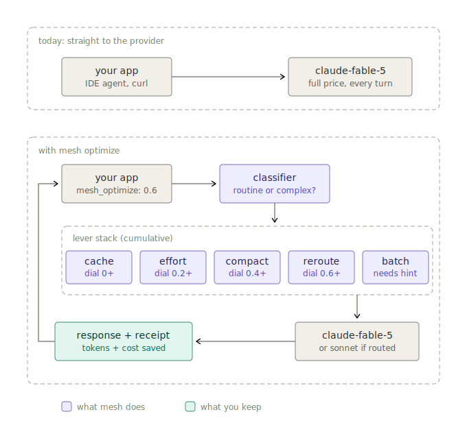

# mesh-optimize

Gateway-level token optimization for [Mesh API](https://meshapi.ai). One dial from 0 to 0.95, a savings receipt on every response, and no change to your code beyond a single request field.



## Why

Claude Fable 5 costs $10 per million input tokens and $50 per million output tokens. Its agentic clients re-send a system prompt of roughly 120k tokens plus the entire growing conversation on every turn. Users report draining a $100 plan in under 9 minutes. Most of that spend is the same bytes billed at full price over and over.

mesh-optimize sits in the gateway request path. It intercepts the request, applies cost levers matched to your risk tolerance, forwards to the provider, and attaches an honest accounting of what you saved.

## Quickstart

One field on any OpenAI-compatible request through Mesh:

```bash
curl https://api.meshapi.ai/v1/chat/completions \
  -H "Authorization: Bearer $MESH_API_KEY" \
  -H "Content-Type: application/json" \
  -d '{
    "model": "claude-fable-5",
    "messages": [{"role": "user", "content": "fix the failing test in auth.ts"}],
    "mesh_optimize": 0.3
  }'
```

Every optimized response carries a receipt:

```json
"mesh_savings": {
  "tokens_saved": 41200,
  "cost_saved_usd": 1.87,
  "levers_applied": ["cache_injection", "effort_downgrade", "tool_result_pruning"],
  "baseline_estimate_method": "pre_optimization_char_estimate_div4"
}
```

### As middleware

```ts
import { MeshOptimizer, attachSavings } from "mesh-optimize";

const optimizer = new MeshOptimizer({ defaultDial: 0.2 });

// in the gateway request path
const { request, plan } = optimizer.prepare(incomingBody);
const providerResponse = await forwardToProvider(request);
const response = attachSavings(plan, providerResponse);
```

`prepare` is deterministic: identical input bytes always produce identical output bytes. That is not a nicety, it is what keeps cache hit rates above zero.

## The dial

Levers are cumulative. Each tier includes everything below it.

| dial | levers | quality risk |
|------|--------|--------------|
| 0 | everything off, byte-identical passthrough | none |
| 0 to 0.2 | cache_control injection on system prompts and stable prefixes, max_tokens defaults per task type | none |
| 0.2 to 0.4 | effort medium on routine calls (Anthropic models only), pruning of tool results already consumed in earlier turns | minimal |
| 0.4 to 0.6 | context compaction, subagent caps (phase two) | low |
| 0.6 to 0.8 | model routing for classified-simple calls, effort low, relevance filtering (phase three) | moderate, always disclosed |
| 0.8 to 0.95 | batch routing without a hint, hard compaction | high, power users |

Omit `mesh_optimize` and your key's dashboard default applies. No default set means 0, fully off.

## Hints

The dial answers one question: how much quality risk do you accept. Some levers depend on facts about your workload that no dial value can infer, so there is a second, small field for facts:

```json
"mesh_hints": {
  "latency": "flexible",
  "session_id": "user-42-chat-7"
}
```

- `latency: "flexible"` unlocks batch routing (50% off everything, identical model and output quality) at any dial value. Without it, batch waits for dial 0.8.
- `session_id` tags requests that belong to the same conversation. The gateway is stateless; this is what lets it place cache breakpoints across turns and pre-warm caches before they expire.

Hints describe your workload. They never toggle individual levers. The dial stays the only knob.

## Where the savings come from

| source | saves | applies to |
|--------|-------|------------|
| cache injection | about 90% off repeated input | agentic and long-session traffic |
| batch routing | 50% off everything, stacks with cache | latency-flexible traffic |
| tool result pruning | dead weight the model already consumed | tool-heavy loops |
| effort routing | shorter reasoning on routine calls | Anthropic models |
| model routing | up to 80% on rerouted calls | the only lever that touches quality |

A latency-flexible agentic workload with a large system prompt can stack cache and batch into the 90 to 95% range on input cost without touching the quality levers. A realtime chatbot with short unique prompts cannot, and your dashboard will say so rather than pretend otherwise.

## Honest savings math

The receipt never inflates:

- Pruned tokens count as `tokens_saved` at full input price, estimated at four characters per token. The method is disclosed in `baseline_estimate_method` on every response.
- Cache reads do not reduce the token count, they reduce the price. The receipt credits the 90% read discount and debits the 25% write premium the optimizer caused.
- A cold cache write can make `cost_saved_usd` slightly negative on the first request of a session. It is reported as is, not clamped.
- Effort downgrades are not claimed as savings because their counterfactual cannot be measured per request.

## Hard rules

1. Content inside an existing cache breakpoint is never compacted or modified. Cached input is 90% off; breaking a cache to save raw tokens is a net loss.
2. Cache injection is deterministic. Same prefix in, same breakpoints out.
3. If the client already set `cache_control`, the optimizer defers entirely.
4. Model routing is always visible: `levers_applied` plus the actual model in the standard `model` field. No silent swaps.
5. `mesh_optimize: 0` bypasses everything, including the parameter guards.
6. Every removed byte is logged: lever, action, and a sha256 of the original content, so "why did the model forget X" has an answer.
7. Fable 5 parameter guards: `temperature` other than 1.0, `top_k`, and `thinking: disabled` are stripped before forwarding, because Fable rejects them and the optimizer must never be the reason a request fails.

## What ships when

- Phase one (this package): cache injection, max_tokens defaults, effort routing, tool result pruning, batch eligibility via hints, the classifier, savings accounting, audit log.
- Phase two: proactive context compaction at 60% of the context window, subagent caps.
- Phase three: model routing, relevance-based context filtering, full dial UX in the dashboard.
- Phase four: A/B quality mode, 10% of opted-in traffic runs unoptimized and the quality delta is reported next to the savings.

## Development

```bash
npm install
npm test    # compiles and runs the suite, 22 tests
```

No runtime dependencies. TypeScript and Node 20 or newer.

## License

MIT
